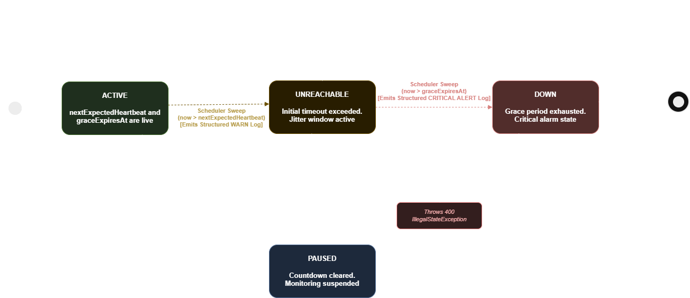

# Pulse-Check-API ("Watchdog" Sentinel)

The **Pulse-Check-API** is a production-grade Dead Man's Switch service engineered for **CritMon Servers Inc.** It monitors remote infrastructure (such as unmanned weather stations and solar farms) operating over unstable, low-bandwidth networks. Instead of waiting for a human operator to discover an outage manually, this system continuously counts down configurable keep-alive windows and proactively signals critical outages the moment a hardware element stops transmitting heartbeats.

---

## 🗺️ System Architecture & State Machine

The service is engineered around an explicit, domain-driven finite state machine (FSM). Rather than running volatile in-memory timers (`setTimeout`) that vanish during deployment rollouts or instance crashes, state transitions are driven by incoming REST telemetry and processed asynchronously by a high-throughput relational engine.



---

## 🚀 The Developer's Choice: Intelligent Grace Period & Jitter Protection

### The Problem

CritMon’s field assets are deployed in remote geographical zones characterized by fragile cellular connectivity and intermittent packet dropouts. In a naive system architecture, missing a single heartbeat by even a fraction of a second immediately triggers an outage event. This behavior leads to **alert fatigue**—flooding support channels with false alarms triggered by transient network routing jitter, forcing engineers to eventually ignore the alerting system entirely.

### My Solution

I implemented a two-tiered validation workflow natively within the core entity business domain utilizing an intermediate **`UNREACHABLE`** state paired with a customizable network `grace_period`.

1. **Phase 1 (Warning Transient):** If a device passes its primary `timeout` duration without a ping, its status shifts from `ACTIVE` to `UNREACHABLE`. The system issues a low-impact warning metric to log collectors, but suppresses high-priority notifications.
2. **Phase 2 (Self-Healing Recovery):** If the remote hardware successfully re-establishes a connection and issues a heartbeat while inside this grace window, it seamlessly snaps back to `ACTIVE` status automatically.
3. **Phase 3 (Critical Alerting):** Only when the `grace_expires_at` timestamp is completely bypassed does the system lock into a true **`DOWN`** state, triggering structured critical alarms for immediate dispatch teams.

### Database Performance Optimization

To handle thousands of distributed heartbeats safely without linear degradation, I introduced **Conditional Partial Indexes** inside the Liquibase migration framework:

```sql
CREATE INDEX IF NOT EXISTS idx_monitors_sweeper_active
ON monitors (status, next_expected_heartbeat) WHERE status = 'ACTIVE';

CREATE INDEX IF NOT EXISTS idx_monitors_sweeper_unreachable
ON monitors (status, grace_expires_at) WHERE status = 'UNREACHABLE';

```

This guarantees that the asynchronous system sweeper runs index-only scans, filtering down exactly to the small subset of failing monitors rather than executing heavy table scans across thousands of healthy nodes.

---

## 💻 Setup & Execution Instructions

### Prerequisites

- **Docker Desktop** or **Docker Engine** installed and running.
- Git (to clone the repository).

### Running the Application via Docker Compose

The entire stack—including the application backend and its persistent database layer—is fully containerized using the local `Dockerfile.dev` and `docker-compose.yaml` infrastructure.

1. **Clone the repository:**

```bash
git clone https://github.com/Leroy0010/Pulse-Check-API.git

```

```
cd backend
```

2. **Configure Environment Variables:**

Create a local `.env` file in the root directory of the project based on the provided configuration template:

```bash
cp .env.example .env

```

_Open the newly created `.env` file and adjust any database credentials, ports, or profile flags if necessary._  
3. **Build and launch the containers:**

```bash
docker compose up --build -d

```

4. **Verify Application Availability:**

The server will compile, run database migrations automatically, and expose the HTTP API gateway on port `8080`.

### Interactive API Exploration

Once the containerized service initiates successfully, you can view, test, and step through all input parameters inside the automated interactive documentation panel:

👉 **[Interactive Swagger UI Dashboard](http://localhost:8080/swagger-ui/index.html)**

---

## 📋 API Documentation & Endpoint Reference

### Global Constraints

- All inputs are validated at the controller boundary.
- Missing, malformed, or out-of-bounds metrics automatically trigger typed JSON validation payloads.
- All successful tracking operations return a standardized payload wrapper envelope (`ApiResponse<T>`).

### Endpoint Matrix

| Method     | Endpoint                   | Description                                             | Access Layer                 |
| ---------- | -------------------------- | ------------------------------------------------------- | ---------------------------- |
| **POST**   | `/monitors`                | Registers a new watchdog configuration                  | Administrator / Provisioning |
| **POST**   | `/monitors/{id}/heartbeat` | Submits a live ping to reset active windows             | Remote IoT Device            |
| **POST**   | `/monitors/{id}/pause`     | Suspends all countdown tracking safely                  | Maintenance Technician       |
| **GET**    | `/monitors/{id}`           | Retrieves specific metadata & remaining window          | Monitoring Dashboard         |
| **GET**    | `/monitors`                | Queries paginated entries with optional state filtering | Operator Panel               |
| **DELETE** | `/monitors/{id}`           | Purges a configuration entry completely                 | System Administrator         |

---

### Core Endpoint Implementations & Payloads

#### 1. Register a Monitor

Initializes a tracked switch entity. If `gracePeriod` is omitted from the request body, the backend applies a protective **15-second** system default automatically.

- **URL:** `POST /monitors`
- **Payload Example:**

```json
{
    "id": "solar-farm-node-402",
    "timeout": 60,
    "gracePeriod": 20,
    "alertEmail": "oncall-tier1@critmon.com"
}
```

- **Response Example (`201 Created`):**

```json
{
    "timestamp": "2026-06-21T14:10:00.123",
    "success": true,
    "message": "Monitor registered and initialized successfully",
    "data": {
        "id": "solar-farm-node-402",
        "expiresAt": "2026-06-21T14:11:00.000Z"
    }
}
```

#### 2. Device Heartbeat Ping

Resets the countdown tracking metrics back to baseline. Can be processed dynamically even while a device is marked `UNREACHABLE` or `PAUSED`.

- **URL:** `POST /monitors/solar-farm-node-402/heartbeat`
- **Response Example (`200 OK`):**

```json
{
    "timestamp": "2026-06-21T14:10:45.456",
    "success": true,
    "message": "Heartbeat received successfully. Watchdog window reset.",
    "data": {
        "id": "solar-farm-node-402",
        "status": "ACTIVE",
        "expiresAt": "2026-06-21T14:11:45.456Z",
        "remainingSeconds": 60
    }
}
```

#### 3. Pause Monitor (Snooze Functionality)

Allows engineers to halt monitoring triggers during active physical component maintenance cycles.

- **URL:** `POST /monitors/solar-farm-node-402/pause`
- **Response Example (`200 OK`):**

```json
{
    "timestamp": "2026-06-21T14:12:00.789",
    "success": true,
    "message": "Watchdog tracking paused. Countdown suspended.",
    "data": {
        "id": "solar-farm-node-402",
        "status": "PAUSED"
    }
}
```

> 🛑 **Operational Safeguard:** Executing a pause request against a monitor that has already fully shifted to a `DOWN` state will result in a validation failure (`400 Bad Request`), preventing personnel from covering up existing system outages post-facto.

#### 4. Query All Tracked Monitors

Fetches a fully paginated, sorted grid of active system configurations with optional query filters.

- **URL:** `GET /monitors?status=UNREACHABLE&page=0&size=10`
- **Response Example (`200 OK`):**

```json
{
    "timestamp": "2026-06-21T14:15:00.000",
    "success": true,
    "message": "Monitors fetched successfully.",
    "data": {
        "content": [
            {
                "id": "weather-station-09",
                "timeout": 30,
                "alertEmail": "admin-weather@critmon.com",
                "status": "UNREACHABLE",
                "expiresAt": "2026-06-21T14:15:20.000Z",
                "remainingSeconds": 20
            }
        ],
        "pageable": {
            "pageNumber": 0,
            "pageSize": 10
        },
        "totalPages": 1,
        "totalElements": 1
    }
}
```

## 🛡️ Unified Error Handling Architecture

The API exposes a highly predictable, standardized exception handling pipeline. Every client-side or server-side error emits an `ApiError` payload wrapped with fine-grained contextual details.

### Standardized Error Format

```json
{
    "timestamp": "2026-06-21T14:20:00.101",
    "status": 400,
    "error": "Bad Request",
    "message": "Validation failed.",
    "details": {
        "timeout": ["Timeout must be at least 5 seconds"],
        "alertEmail": ["Invalid email format"]
    },
    "code": "VALIDATION_FAILED"
}
```

### Enumerated System Error Codes

| Error Code                 | HTTP Counterpart   | Architectural Context Trigger                                          |
| -------------------------- | ------------------ | ---------------------------------------------------------------------- |
| `RESOURCE_NOT_FOUND`       | `404 Not Found`    | Attempted target heartbeat or pause on an unmapped key.                |
| `MONITOR_ALREADY_EXISTS`   | `409 Conflict`     | Attempted registration using an active device identification string.   |
| `VALIDATION_FAILED`        | `400 Bad Request`  | Constraint annotations violated on inbound model attributes.           |
| `INVALID_STATE_TRANSITION` | `400 Bad Request`  | Trying to transition an immutable state (e.g., pausing a `DOWN` unit). |
| `INTERNAL_SERVER_ERROR`    | `500 Server Error` | Unexpected global exceptions safely caught at the boundary.            |
